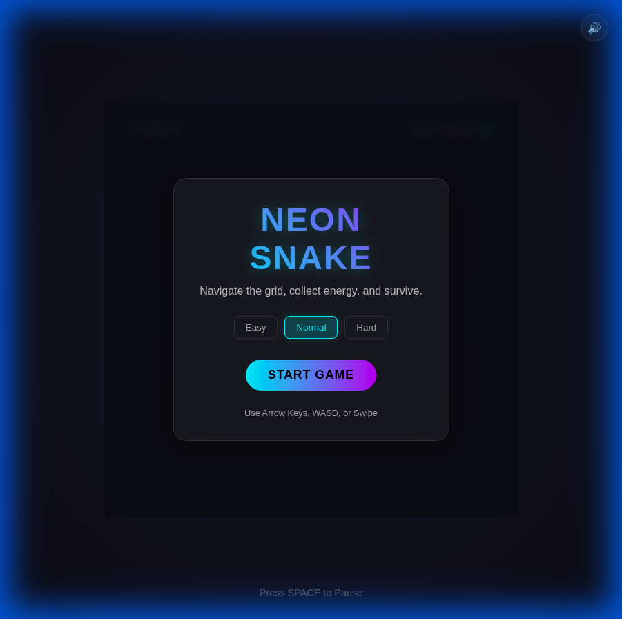
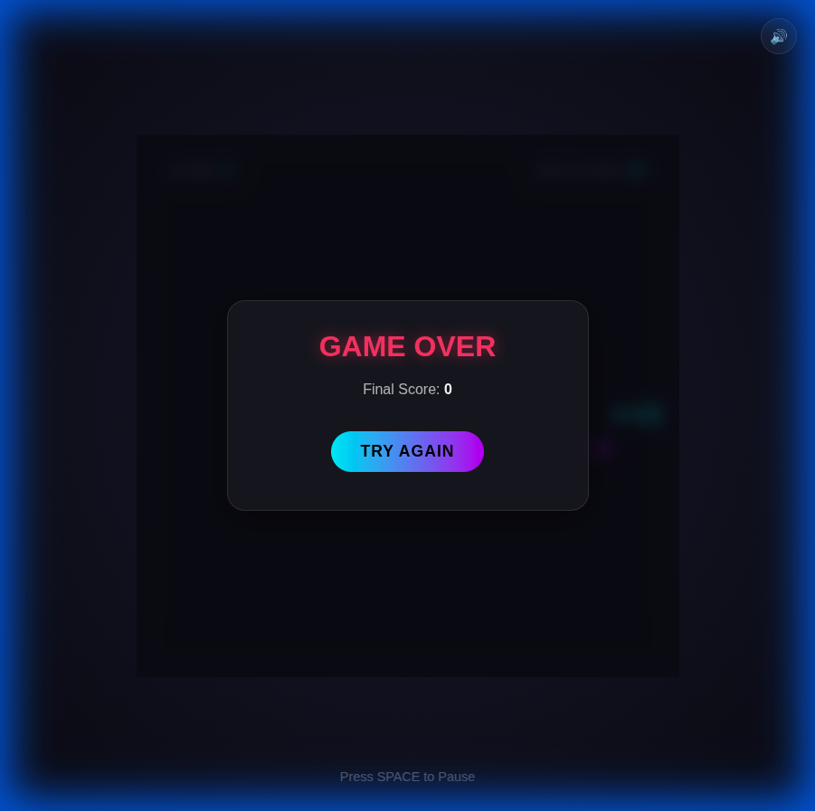

# Neon Snake

A visually stunning, modern Snake game built in a single HTML file.

## Features
- **Visuals**: Dark gradient background, glassmorphism UI, neon glow effects, and particle explosions.
- **Gameplay**: Smooth snake movement, special power-up food, progressive difficulty.
- **Audio**: Synthesized sound effects using Web Audio API (no external files).
- **Controls**: Keyboard (Arrow/WASD) and Touch (Swipe).
- **Responsiveness**: Adapts to screen size, works on mobile.

## Screenshots

### Start Screen

### Gameplay

## How to Play
1.  Open `index.html` in your browser.
2.  Select difficulty (Easy/Normal/Hard).
3.  Click **Start Game**.
4.  Use Arrow keys or WASD to move. On mobile, swipe to change direction.
5.  Eat food to grow and score points. Special food gives bonus points!
6.  Avoid walls and yourself.
7.  Press **Space** to pause.

## Deployment
This game is ready for GitHub Pages!
1.  Upload files to your repository.
2.  Go to Settings > Pages.
3.  Select `main` branch and save.
